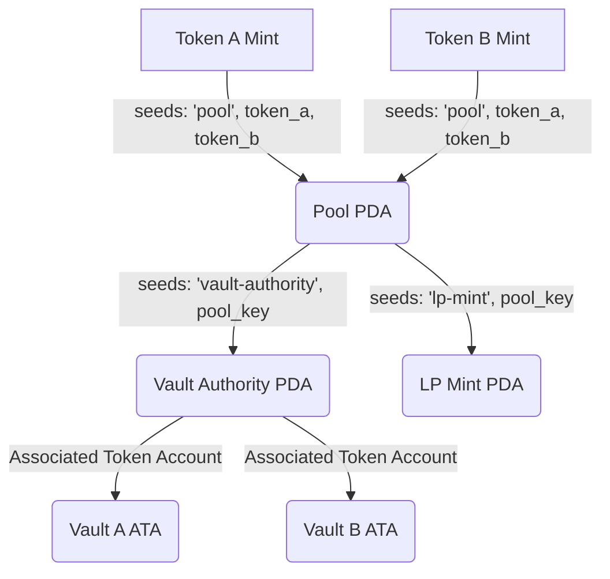

# SOLDex Protocol Architecture

This document describes the design mechanics, data structures, math formulas, and software architecture of the SOLDex AMM protocol.

---

## 1. On-Chain Smart Contract Overview

SOLDex implements a constant-product Automated Market Maker (AMM) on the Solana blockchain using the **Anchor Framework**.

### Core Operations
* `initialize_pool`: Instantiates a trading pool for any pair of SPL tokens, deriving vault authority, LP mint, and token vault accounts.
* `deposit_liquidity`: Allows users to deposit Token A and Token B to receive LP tokens proportional to their share of the pool.
* `withdraw_liquidity`: Allows users to burn LP tokens to withdraw Token A and Token B reserves.
* `swap`: Executes a trade of Token A for Token B (or vice versa), transferring tokens according to the AMM pricing formula.

---

## 2. Mathematical Model

SOLDex uses the standard Uniswap V2 Constant Product pricing model:

$$x \cdot y = k$$

Where:
* $x$ = Pool Reserve of Token A
* $y$ = Pool Reserve of Token B
* $k$ = Invariant constant

### Swap Exchange Rate
To ensure the invariant $k$ remains constant after a trade, the output amount $dy$ for a given input amount $dx$ is calculated as:

$$dy = \frac{dx \cdot (1 - f) \cdot y}{x + dx \cdot (1 - f)}$$

SOLDex enforces a **0.30%** trading fee ($f = 0.003$). This translates to:

$$\text{amount\_out} = \frac{\text{amount\_in} \cdot 997 \cdot \text{reserve\_out}}{\text{reserve\_in} \cdot 1000 + \text{amount\_in} \cdot 997}$$

---

## 3. Account Derivations (PDAs)

To ensure secure custody of vault tokens, SOLDex relies on Program Derived Addresses (PDAs) derived from the Program ID:



1. **Pool PDA**: Tracks reserves, mints, and fee configuration.
   * Seeds: `[b"pool", token_a_mint.key(), token_b_mint.key()]`
2. **Vault Authority PDA**: The signature-less account that holds authority over the vault associated token accounts.
   * Seeds: `[b"vault-authority", pool.key()]`
3. **LP Mint PDA**: Represents the mint account for the pool's LP tokens.
   * Seeds: `[b"lp-mint", pool.key()]`
4. **Token Vaults (Vault A & B)**: Standard Associated Token Accounts (ATAs) owned by the **Vault Authority PDA**. Because the PDA is off the curve, `allowOwnerOffCurve = true` is required during derivation.

---

## 4. Frontend Code Architecture

The frontend is structured to maintain clean separation of concerns:

```text
┌─────────────────────────────────────────────────────────┐
│                       React UI                          │
│        (SwapPage, LiquidityPage, AnalyticsPage)         │
└────────────────────────────┬────────────────────────────┘
                             ▼
┌─────────────────────────────────────────────────────────┐
│                     React Hooks                         │
│     (useSwap, useLiquidity, usePool, useTokens)        │
└────────────────────────────┬────────────────────────────┘
                             ▼
┌─────────────────────────────────────────────────────────┐
│                   Anchor Services                       │
│      (swap.ts, liquidity.ts, pool.ts, tokens.ts)        │
└────────────────────────────┬────────────────────────────┘
                             ▼
┌─────────────────────────────────────────────────────────┐
│                   Solana Blockchain                     │
│               (Anchor Program & Devnet)                 │
└─────────────────────────────────────────────────────────┘
```

### 1. Services Layer (`src/services/anchor/`)
Low-level transaction construction and RPC calls:
* `program.ts`: Instantiates the Anchor `Program` provider.
* `tokens.ts`: SPL token balance queries and faucet minting.
* `pool.ts`: Fetches pool state accounts and sends pool initialization instructions.
* `swap.ts`: Computes rate output, verifies ATAs, and executes swaps.
* `liquidity.ts`: Combines check/create ATA pre-instructions with deposit/withdraw instructions.

### 2. Custom Hooks Layer (`src/hooks/`)
Provides React components with transactional state, load states, and input handler callbacks. Prevents components from directly managing Solana Web3 and Anchor dependencies.

### 3. Zustand Stores (`src/stores/`)
* `useTokenStore.ts`: Tracks local user token selections and balances.
* `usePoolStore.ts`: Caches state of the currently active trading pool and list of all pools.
